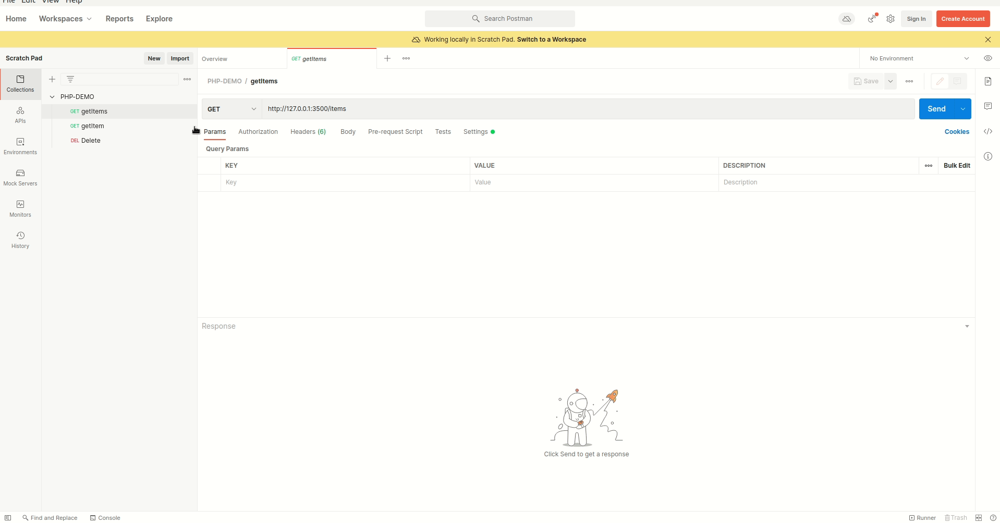

# NATIVE PHP WEB API DEMO

This is a solution of creating basic CRUD operation using native php

## Table of contents

- [Overview](#overview)
    - [Screenshot](#screenshot)
- [My process](#my-process)
    - [Built with](#built-with)
    - [Libraries](#Libraries)
- [Author](#authors)

## Overview

### GIF




<p align="right">(<a href="#top">back to top</a>)</p>

## My process
1) Clone the project

   ``` git clone https://github.com/MohamedEldefrawy/PHP-WebApi-Demo.git```
2) install [composer](https://getcomposer.org/)
3) in the project directory run the following
    ```
    $composer install
    $composer dump-autoload
    $php -S 127.0.0.1:8000 #to test locally
    ```
<p align="right">(<a href="#top">back to top</a>)</p>

### Built with

* [PHP Native](https://www.php.net/)

<p align="right">(<a href="#top">back to top</a>)</p>

### Libraries

* [composer](https://getcomposer.org/)
* [illuminate](https://packagist.org/packages/illuminate/database)

<p align="right">(<a href="#top">back to top</a>)</p>

## Authors


* LinkedIn - [Mohamed Eldefrawy](https://www.linkedin.com/in/mohamedeldefrawy)

<p align="right">(<a href="#top">back to top</a>)</p>